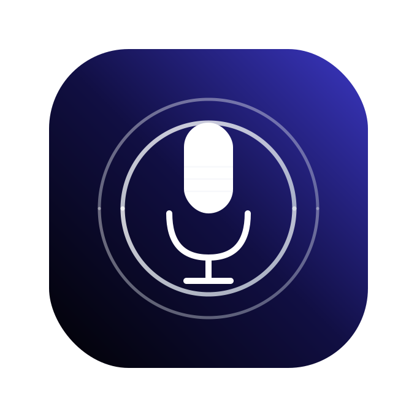
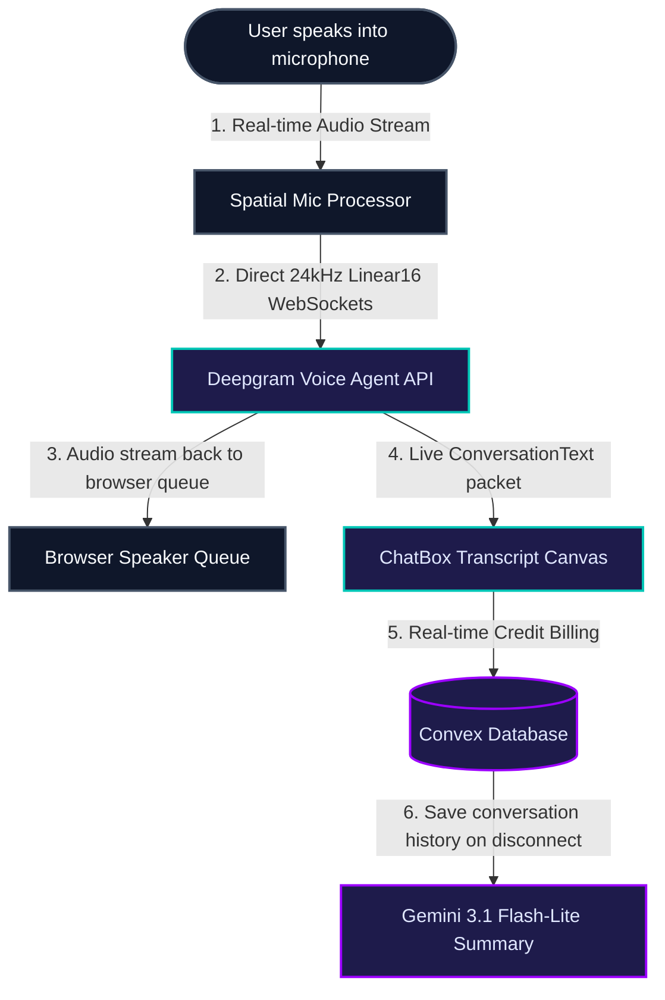

<div align="center">
  
  <h1>🎙️ VocalVista — AI-Native Voice-to-Voice Coach</h1>
  
  <p align="center">
    
    
    
    
    
    
  </p>
</div>

### Real-Time Conversational Coaching & Speech Mastery

VocalVista is an AI-native voice-coaching workspace designed to sharpen public speaking, interview delivery, storytelling, and language fluency. Powered by a unified WebSocket voice-to-voice stream, VocalVista matches you with specialized AI expert personas to simulate low-latency interactive scenarios, analyze verbal habits, and generate comprehensive progress diagnostics.

---


## The Engine: Unified Temporal Architecture

VocalVista operates on a bi-directional WebSocket interface communicating with Deepgram's Voice Agent client.

### Interactive Data Flow



---

## Core Features

-   **Unified Voice-to-Voice**: Sub-second, full-duplex conversational voice training powered directly by Deepgram's Voice Agent API.
-   **Interactive Coaching Modes**: Toggle specialized modes including Mock Interviews, Presentation Prep, Debate Practice, Language Learning, and Mindfulness Meditation.
-   **Expert Coach Cast**: Train with dedicated personas including Sofia (Warm & Encouraging), Ethan (Professional & Structured), or Justin (Dynamic & Energetic).
-   **Detailed Feedback Diagnostics**: Receive comprehensive post-session analysis, structured coaching notes, and action plans powered by Gemini 3.1 Flash-Lite.
-   **Dynamic Call Transcripts**: Track your conversation visually with real-time speech-bubble logs that stream alongside the live voice session.
-   **Real-time Credit Protection**: Dynamic character-billing safely auto-suspends your call if credit balances hit zero, preventing unexpected costs.

---

## Screenshots

<div align="center">
  
  
  
  
  
</div>

---

## Voice Agent Capabilities

VocalVista runs on a highly customizable instruction layout. It supports a comprehensive range of direct voice mechanics:

| Coaching Dimension | Custom Instructions | Core Model | Target Outcome |
| :--- | :--- | :--- | :--- |
| **Mock Interview** | Interrogate on specific roles, provide constructive tips, keep short. | `gpt-4o` | Realistic HR panel simulations and professional posture. |
| **Debate Lab** | Direct logical rebuttals, critique arguments. | `gpt-4o` | Rapid reasoning, cognitive clarity, and articulation skills. |
| **Mindful Meditation** | Slow soothing speech, pacing, breathing instructions. | `gpt-4o` | Stress relief, pacing control, and clear voice breathing. |
| **Language Practice** | Vocabulary guidance, syntax review, pronunciation guides. | `gpt-4o` | Pronunciation fluency, syntax corrections, and active speaking. |

---

## Tech Stack

-   **Frontend**: Next.js 15 (Turbopack), Tailwind CSS, Framer Motion, Radix UI.
-   **Backend**: Convex (Real-time Database, Serverless Mutations & Queries).
-   **Authentication**: Stack Auth (Cloud-native identity management).
-   **V2V Engine**: Deepgram Voice Agent API (WebSocket duplex stream).
-   **Diagnostics**: Google Gemini 3.1 Flash-Lite.

---

## Getting Started

### 1. Environment Configuration
Create a `.env.local` file in your root folder:
```env
# 🏢 Convex Backend Deployment Configuration
CONVEX_DEPLOYMENT=your_convex_deployment_name
NEXT_PUBLIC_CONVEX_URL=your_convex_url

# 🎤 Voice Processing API (Deepgram)
DEEPGRAM_API_KEY=your_deepgram_api_key
NEXT_PUBLIC_DEEPGRAM_API_KEY=your_deepgram_api_key

# 🔐 Authentication (Stackframe)
NEXT_PUBLIC_STACK_PROJECT_ID=your_stack_project_id
NEXT_PUBLIC_STACK_PUBLISHABLE_CLIENT_KEY=your_publishable_client_key
STACK_SECRET_SERVER_KEY=your_secret_server_key

# 🧠 Diagnostics (Google Gemini)
GEMINI_API_KEY=your_gemini_api_key
```

### 2. Install & Run
```bash
# Install package dependencies
npm install

# Start local server
npm run dev
```

---
*Built for real-time speech mastery.*
