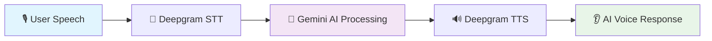

## ✨ What is VocalVista?

VocalVista transforms the way people develop their speaking skills through **AI-powered voice coaching**. Whether you're preparing for job interviews, perfecting presentations, learning new languages, or building confidence in public speaking, our platform provides real-time feedback and personalized guidance.

### 🎯 **The Magic Behind VocalVista**



Our intelligent **STT-LLM-TTS pipeline** creates seamless voice-to-voice interactions:
- 🎤 **Real-time Speech Recognition** → Captures your voice with millisecond precision
- 🧠 **AI Processing** → Analyzes content and generates personalized responses  
- 🔊 **Natural Voice Synthesis** → Delivers coaching in professional voices

---

## 🚀 Key Features

<table>
<tr>
<td width="50%">

### 🎯 **Smart Coaching Modes**
- 💼 **Mock Interviews** - Practice with AI interviewers
- 🎤 **Presentation Training** - Perfect your delivery
- 🗣️ **Debate Practice** - Sharpen your arguments
- 📚 **Language Learning** - Improve pronunciation
- 📖 **Storytelling** - Craft compelling narratives
- 🧘 **Meditation Guidance** - Mindful speaking
- 🔤 **Pronunciation Drills** - Perfect your accent
- 💪 **Confidence Coaching** - Build speaking confidence

</td>
<td width="50%">

### 🎭 **Expert Voice Personas**
- 👨‍🏫 **Ethan** - Professional & Authoritative
- 👩‍💼 **Sofia** - Warm & Encouraging  
- 👨‍💻 **Justin** - Dynamic & Energetic
- 👩‍🎨 **Amy** - Creative & Inspiring
- 👨‍🔬 **Brian** - Analytical & Precise

### 📊 **Advanced Analytics**
- 📈 Real-time progress tracking
- 📋 Detailed session summaries
- 🎯 Personalized improvement suggestions
- 📝 Comprehensive coaching notes

</td>
</tr>
</table>

---

## 🛠️ Technology Stack

<div align="center">

### **Frontend Architecture**


### **AI & Voice Processing**


### **Backend & Database**


### **Deployment & Tools**
[](https://www.netlify.com/)


</div>

## 📷 Screenshots


### 🏗️ **Architecture Overview**

| Component | Technology | Purpose |
|-----------|------------|---------|
| **🎨 Frontend** | Next.js 14+, React 18, Tailwind CSS | Server-rendered UI with modern styling |
| **🧠 AI Engine** | Google Gemini 2.0 Flash | Conversational AI for coaching responses |
| **🎤 Speech-to-Text** | Deepgram WebSocket Streaming | Real-time voice transcription |
| **🔊 Text-to-Speech** | Deepgram REST API | Professional voice synthesis |
| **💾 Database** | Convex | Real-time backend with instant sync |
| **🎭 UI Components** | Radix UI + shadcn/ui | Accessible, beautiful components |

---## 🚀 Quick Start

### 📋 **Prerequisites**
- **Node.js** 18+ installed
- **npm** or **yarn** package manager
- **Git** for version control

### ⚡ **Installation**

```bash
# 1️⃣ Clone the repository
git clone https://github.com/samolubukun/Vocal-Vista.git
cd vocal-vista

# 2️⃣ Install dependencies
npm install

# 3️⃣ Set up environment variables
cp .env.example .env.local
```

### 🔐 **Environment Configuration**

Create a `.env.local` file with the following variables:

```env
# 🏢 Convex Backend
NEXT_PUBLIC_CONVEX_URL=your_convex_deployment_url

# 🧠 AI Configuration  
GEMINI_API_KEY=your_gemini_api_key

# 🎤 Voice Processing (Deepgram)
NEXT_PUBLIC_DEEPGRAM_API_KEY=your_deepgram_api_key
```

> **🔒 Security Note:** `NEXT_PUBLIC_DEEPGRAM_API_KEY` is used client-side. Ensure proper API key scoping in production.

### 🏃‍♂️ **Development**

```bash
# Start the development server
npm run dev

# Open your browser
open http://localhost:3000
```

### 🔧 **Additional Setup**

```bash
# Deploy Convex backend
npx convex deploy

# Build for production
npm run build

# Start production server
npm start
```

---

## 🌐 Deployment

### 🚀 **One-Click Deploy to Vercel** *(Recommended)*

[](https://vercel.com/new/clone?repository-url=https://github.com/your-username/vocal-vista)

### 📦 **Manual Deployment Options**

<details>
<summary><strong>🔵 Vercel Deployment</strong></summary>

```bash
# Install Vercel CLI
npm i -g vercel

# Deploy to production
vercel --prod

# Deploy Convex backend
npx convex deploy
```

</details>

<details>
<summary><strong>🐳 Docker Deployment</strong></summary>

```bash
# Build Docker image
docker build -t vocal-vista:latest .

# Run container
docker run -p 3000:3000 \
  -e NEXT_PUBLIC_CONVEX_URL=your_url \
  -e GEMINI_API_KEY=your_key \
  -e NEXT_PUBLIC_DEEPGRAM_API_KEY=your_key \
  vocal-vista:latest
```

</details>

<details>
<summary><strong>☁️ Traditional Hosting</strong></summary>

```bash
# Build the application
npm run build

# Start production server
npm start

# Deploy Convex functions
npx convex deploy
```

</details>

### 🔧 **Production Environment Variables**

```env
# Required for all deployments
NEXT_PUBLIC_CONVEX_URL=https://your-convex-deployment.convex.cloud
GEMINI_API_KEY=your_production_gemini_key
NEXT_PUBLIC_DEEPGRAM_API_KEY=your_production_deepgram_key

# Optional: Custom domain configuration
NEXTAUTH_URL=https://your-domain.com
```

---

## 📊 Performance & Best Practices

### ⚡ **Optimization Features**
- 🎯 **Real-time Processing** - Sub-100ms response times with Deepgram streaming
- 📱 **Mobile Responsive** - Optimized for all device sizes
- 🔒 **Security First** - API key scoping and rate limiting implemented
- 🎨 **Modern UI/UX** - Beautiful, accessible interface with smooth animations

### 🏗️ **Scaling Recommendations**

| Traffic Level | Configuration | Recommendations |
|---------------|---------------|-----------------|
| **👥 Small** (< 1K users) | Single Vercel deployment | Use free tiers, basic monitoring |
| **🏢 Medium** (1K-10K users) | Load balancer + CDN | Implement caching, database optimization |
| **🚀 Enterprise** (10K+ users) | Multi-region deployment | Auto-scaling, advanced monitoring, dedicated resources |

### 💰 **Cost Management**
- **Deepgram Usage** - Monitor STT/TTS API calls and implement usage limits
- **Convex Scaling** - Database operations scale automatically
- **Gemini AI** - Rate limit requests to control AI processing costs

---

## 🤝 Contributing

We welcome contributions from the community! Here's how you can help:

### 🐛 **Reporting Issues**
- Use the [GitHub Issues](https://github.com/your-username/vocal-vista/issues) page
- Include detailed reproduction steps
- Provide browser/environment information

### 💡 **Feature Requests**
- Check existing issues before creating new ones
- Provide clear use cases and benefits
- Include mockups or examples when possible

### 🔧 **Development Contributions**

```bash
# 1️⃣ Fork the repository
# 2️⃣ Create a feature branch
git checkout -b feature/amazing-feature

# 3️⃣ Make your changes
# 4️⃣ Run tests
npm test

# 5️⃣ Commit with conventional commits
git commit -m "feat: add amazing feature"

# 6️⃣ Push and create PR
git push origin feature/amazing-feature
```

### 📝 **Code Style**
- Follow ESLint and Prettier configurations
- Write meaningful commit messages
- Add tests for new features
- Update documentation as needed

---

## 📄 License

This project is licensed under the **MIT License** - see the [LICENSE](./LICENSE) file for details.

---

## 🙏 Acknowledgments

- **[Deepgram](https://deepgram.com)** - For exceptional voice AI technology
- **[Google AI](https://ai.google.dev/)** - For Gemini's conversational capabilities  
- **[Convex](https://convex.dev)** - For seamless real-time backend infrastructure
- **[Vercel](https://vercel.com)** - For effortless deployment and hosting

---

<div align="center">

### 🎤 **Ready to Transform Your Voice?**

**[🚀 Try VocalVista Now](https://vocalvista.netlify.app/)** 

*Empowering confident communicators worldwide, one voice at a time.*

**⭐ Star this repo if you found it helpful!**

</div>

---


